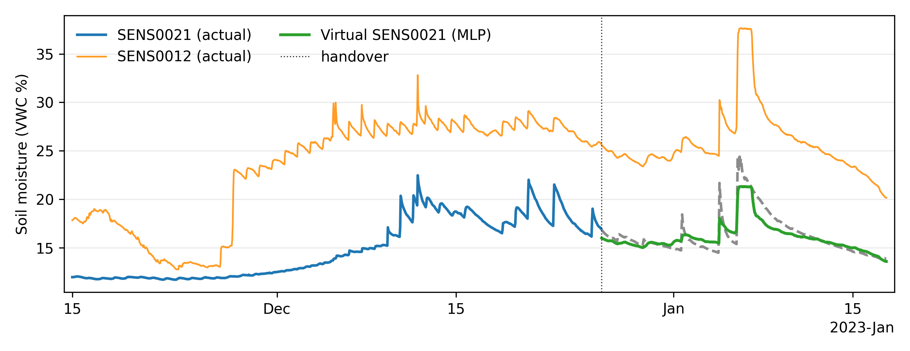
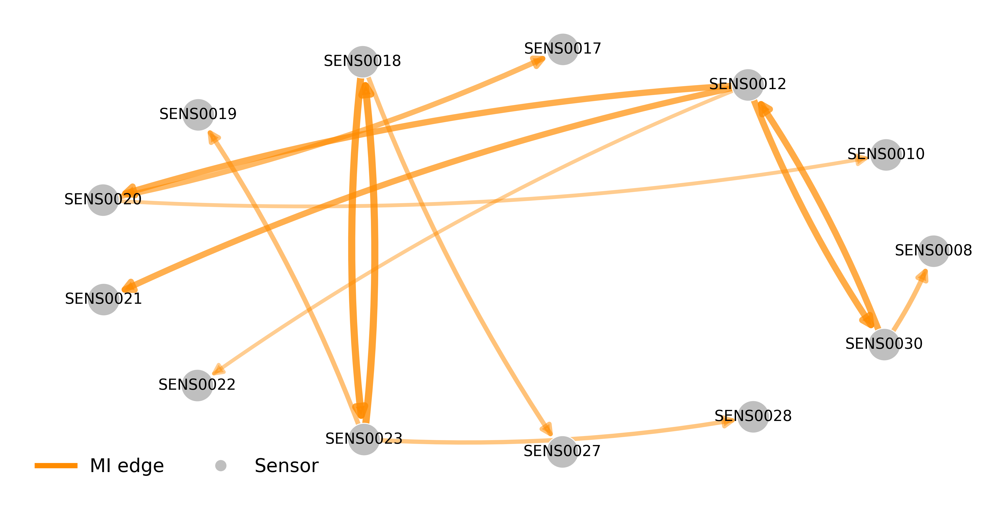

# SIMPaCT demo data

This repository contains example volumetric water content (VWC) data from a test deployment of **13 soil moisture sensors** in Bicentennial Park, Sydney, Australia.  
The dataset supports the experiments described in our paper on mutual-information-based virtual sensor prediction.

## Contents

```
data/
  sopa.csv             # Raw sensor readings
  sopivot+idx.csv      # Preprocessed pivot table with indexed timestamps
  mi_bundle.npz        # Mutual information bundle for analysis
  mi_full.csv          # Full MI matrix
  mi_meta.json         # Metadata for MI analysis
  mi_norm.csv          # Normalised MI values
  mi_pos.csv           # Sensor position data
  mi_pvals.csv         # P-values for MI estimates
  mi_top1_edges.csv    # Top MI edges
  mi_top1_graph.gpickle# Graph of top MI edges
LICENSE                # MIT license for code
LICENSE-DATA.md        # CC BY 4.0 license for dataset
README.md              # This file
```

## Dataset Description

### sopa.csv

Raw sensor readings in CSV format.

**Columns:**

* `index` — Row index from original database extract
* `stream` — Sensor identifier and measurement type
* `value` — Volumetric Water Content (VWC) measurement (%)
* `datetime` — UTC timestamp of measurement in ISO format

**Example:**

```csv
index,stream,value,datetime
13716,meshnet.bicentennialpark.SoilMonitor.SENS0020-SM-SOPA.VWC,8.289648879,2022-11-15 00:07:24.245000+00:00
13717,meshnet.bicentennialpark.SoilMonitor.SENS0020-SM-SOPA.VWC,8.364618613,2022-11-15 00:22:24.475000+00:00
...
```

### sopivot+idx.csv

Processed dataset where sensor readings are pivoted into columns, with timestamps aligned to a regular grid and indexed.

Preprocessing steps:
  - Resampled to hourly cadence (mean over hour).
  - Indexed by timestamp.
  - Sensor IDs simplified to `SENSxxxx`.

**Example:**

```csv
datetime,SENS0018,VWC_SENS0018,SENS0023,VWC_SENS0023,...
2022-11-15 00:00:00,8.30,8.29,7.12,7.14,...
...
```

### Generated Analysis Files

The `mi_*` files in `data/` are generated by our mutual-information analysis pipeline.
They store intermediate and final outputs used to build the MI-based virtual sensor prediction models.
These files are included here to enable reproducibility of the results in our paper.
They can be regenerated from sensor data, but may look slightly different each time due to inherent nondeterminism of the approach.

## Time Span

- Start: 2022-11-15 00:00 UTC  
- End: 2023-01-17 15:00 UTC  
- Frequency: Hourly (processed) / Irregular (raw)

## Sensor IDs

SENS0008, SENS0010, SENS0012, SENS0017, SENS0018, SENS0019, SENS0020, SENS0021, SENS0022, SENS0023, SENS0027, SENS0028, SENS0030.

## Usage Example

```python
import pandas as pd

# Load processed dataset
df = pd.read_csv("data/sopivot+idx.csv", parse_dates=["datetime"], index_col="datetime")

# Select two sensors
sensor_a = "SENS0018"
sensor_b = "SENS0023"

# Plot their VWC over time
df[[sensor_a, sensor_b]].plot(title="Soil Moisture Sensors")
```
---

## Example Visualisations

**Virtual sensor prediction handover:**  
Blue (dashed) – actual sensor; Green (solid) – virtual sensor prediction after handover point.  



**Mutual information graph:**  
Top mutual information edges between sensors, used for virtual sensor selection.  



## License

* **Code** in this repository: MIT License (see `LICENSE`)
* **Data** in this repository: CC BY 4.0 (see `LICENSE-DATA.md`)

If you use this dataset in academic work, please cite our paper.


## Additional Requirements

The mutual information analysis uses the amazing [Java Information Dynamics Toolkit (JIDT)](https://github.com/jlizier/jidt) via `jpype1`.

Download the JIDT jar file (that is the `infodynamics.jar` file) from the [JIDT releases page](https://github.com/jlizier/jidt/releases) and place it in the `code/` directory or update the script path accordingly.

With the intermediate `mi_*` files present, the toolkit is not strictly required to reproduce the graphs, but for any new data you will need it.

---

## Citation

To cite this dataset:

```bibtex
@dataset{SIMPaCTdata2025,
  author       = {Mesut Koçyiğit and Bahman Javadi and Russell Thomson and Sebastian Pfautsch and Oliver Obst},
  title        = {SIMPaCT Soil Moisture Sensor Dataset},
  year         = {2025},
  version      = {1.0},
  doi          = {},
  url          = {https://github.com/OliverObst/simpact-demo-data}
}
```

